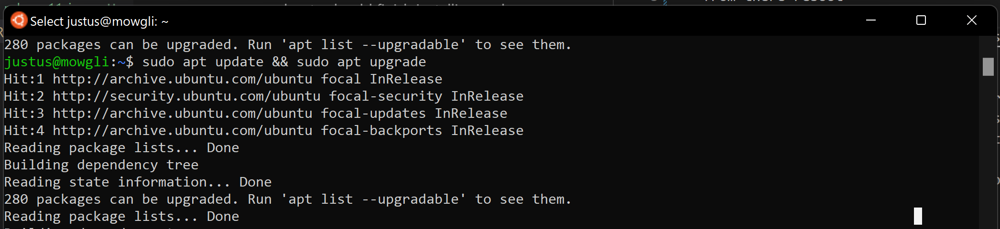

# jhoney's ruby windows 11 notes
## I started here https://www.ruby-lang.org/en/documentation/installation/
### which is why I did a wsl approach https://learn.microsoft.com/en-us/windows/wsl/about

- I created/installed a wsl env
    - aka windows linux subsystem
        - in my case ubuntu
- from there reboot
    - ubuntu should finish installing and open a cli
        - on windows with ubuntu you should see
        - 
    - then from powershell with admin
        - Enable-WindowsOptionalFeature -Online -FeatureName Microsoft-Windows-Subsystem-Linux
            - this it key for ubuntu to be able to find the ruby-full package 
    - then from the ubuntu cli sudo apt-get install ruby-full
    - 
